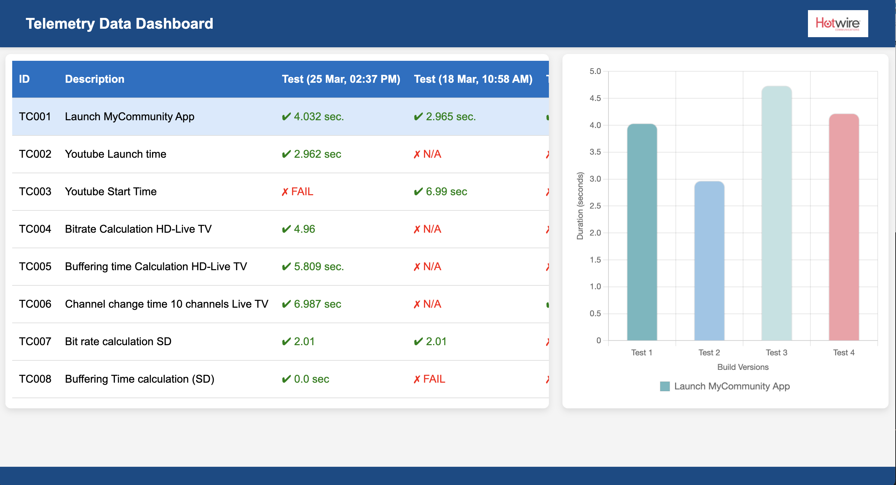

# Automation Test Report Generator

This project contains a Python script and a Flask API for generating and serving HTML reports from automation testing results. It comprises three main components:

## Project Components

1.  **`generate_html_report.py`:** HTML Report Generation Script
    * This Python script is responsible for generating a self-contained HTML report from your automation testing results.
    * It processes raw test data, structures it, and embeds it within an HTML file.
    * The generated HTML report includes a table and chart representation of the test results.
    * The key advantage of this script is that the generated HTML file can be opened and viewed in any web browser without requiring a server or any additional dependencies.

2.  **`read_latest_folder.py`:** Flask API for Test Data
    * This Python script implements a Flask API.
    * The Flask API's purpose is to provide access to the raw automation testing data.
    * It reads data from the automation testing results folder.
    * This API is designed to be consumed by other applications, such as the `report_with_graph.html` page.

3.  **`report_with_graph.html`:** HTML Report with Dynamic Data
    * This HTML file is a web page that displays the test results in a user-friendly format, including tables and charts.
    * Unlike the HTML generated by `generate_html_report.py`, this HTML page does *not* contain the test data directly.
    * Instead, it dynamically fetches the test data from the Flask API (`read_latest_folder.py`) using JavaScript.
    * This allows the report to display the most up-to-date test results whenever the page is loaded.

## Workflow

1.  **Generate Static Report (Optional):**
    * You can use `generate_html_report.py` to create a standalone HTML report. This is useful for archiving or sharing reports that don't need to be constantly updated.
    * Run the script, and it will produce an HTML file.

2.  **Serve Dynamic Report:**
    * To serve a dynamic, always-up-to-date report:
        * Run the Flask API (`read_latest_folder.py`). This will start a web server.
        * Open `report_with_graph.html` in a web browser.
        * The HTML page will fetch the latest test data from the Flask API and display it.

## Detailed Description of Each Component

### 1. `generate_html_report.py`

   * **Purpose:** To create a static HTML report.
   * **Functionality:**
        * Reads test results from a specified folder.
        * Processes the data to extract relevant metrics.
        * Embeds the data into an HTML structure (table and chart).
        * Generates a complete HTML file that can be opened in any browser.
   * **Key Features:**
        * Self-contained report: No server required to view.
        * Table and chart representation of data.
        * Customizable HTML structure.
   * **How to Use:**
        1.  Configure the script to point to your test results folder.
        2.  Run the script.
        3.  The HTML report will be generated.

### 2. `read_latest_folder.py`

   * **Purpose:** To provide a Flask API for accessing test results.
   * **Functionality:**
        * Starts a Flask web server.
        * Defines API endpoints that read test results from the test results folder.
        * Returns the data in a format (e.g., JSON) that can be easily consumed by other applications.
   * **Key Features:**
        * Provides data access over HTTP.
        * Allows for dynamic retrieval of test data.
        * Enables integration with other web applications.
   * **How to Use:**
        1.  Ensure Flask is installed (`pip install Flask`).
        2.  Configure the API to point to your test results folder.
        3.  Run the script.
        4.  The Flask API will start, and you can access the data through the defined API endpoints.

### 3. `report_with_graph.html`

   * **Purpose:** To display a dynamic test report with interactive elements.
   * **Functionality:**
        * Fetches test data from the Flask API (`read_latest_folder.py`) using JavaScript (likely using `fetch` or `XMLHttpRequest`).
        * Parses the data received from the API.
        * Dynamically generates HTML elements (table, chart) to display the data in the browser.
        * Uses JavaScript libraries (e.g., Chart.js) to create interactive charts.
   * **Key Features:**
        * Dynamic data: Displays the latest test results.
        * Interactive charts.
        * User-friendly presentation of data.
   * **How to Use:**
        1.  Ensure the Flask API (`read_latest_folder.py`) is running.
        2.  Open `report_with_graph.html` in a web browser.
        3.  The page will fetch the data from the API and display the report.

## Dependencies

* Python 3.x
* Flask (for `read_latest_folder.py`)
* JavaScript
* Chart.js (or other charting library, used in `report_with_graph.html`)

## Setup and Usage

1.  **Prepare Test Results:** Organize your test results in a folder structure that is accessible to both the Python scripts.

2.  **Configure `generate_html_report.py` (Optional):**
    * If you want to use the static report generation, modify the script to specify the correct test results folder.

3.  **Run Flask API:**
    * Open a terminal, navigate to the directory containing `read_latest_folder.py`, and run:
        ```bash
        python read_latest_folder.py
        ```

4.  **View Dynamic Report:**
    * Open a web browser and open the `report_with_graph.html` file.  Ensure the Flask API is running so the HTML can fetch the data.
      


## Visual Representation of the System

Here's a diagram illustrating the interaction between the components:

<div align="center">
   
</div> 

## Summary

This project provides two ways to view your automation test results:

* A static, self-contained HTML report generated by `generate_html_report.py`.
* A dynamic, interactive report served via a Flask API and displayed by `report_with_graph.html`.

The dynamic report provides the advantage of always displaying the latest test data, while the static report is useful for archiving and sharing.
